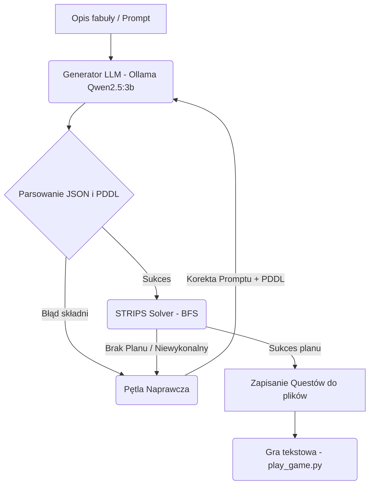

# Raport z Projektu: Generator Gier (Część 2)

## 1. Wstęp i Podział Pracy

Projekt dotyczy eksperymentalnej implementacji automatycznego generatora fabuł i questów do tekstowych gier przygodowych, opartego na domenie PDDL oraz modelach językowych (LLM). Projekt integruje generator scenariuszy korzystający z lokalnego modelu LLM oraz wbudowany planer STRIPS do weryfikacji i naprawy wygenerowanych plików.

### Skład grupy:
- Oskar Kiliańczyk 151863
- Wojciech Kot 151879
- Stanisław Główczewski 151877
- Kacper Dąbrowski #TODO

### Podział pracy:
- Oskar Kiliańczyk
  - TODO
- Wojciech Kot
  - TODO
- Stanisław Główczewski
  - przeprowadzenie testów, ewentualne naprawy questów
  - stworzenie nowego questu, wykorzystując alternatywny model
  - prace nad raportem
- Kacper Dąbrowski
  - TODO

---

## 2. Koncepcja i Architektura Generatora

Zaprojektowany system składa się z trzech głównych komponentów współpracujących ze sobą w ramach potoku generacji i walidacji:

1. **Generator Scenariuszy (`generate_story.py`)**: Przyjmuje krótki opis fabuły od użytkownika i odpytuje lokalną instancję Ollama (domyślnie model `qwen2.5:3b`) za pomocą szczegółowych promptów. Wymusza wyjście w formacie JSON zawierające strukturę 3 zadań wraz z opisami lokacji, przedmiotów, NPC, dialogami i powiązanym kodem PDDL problemu. Kampania jest zapisywana w dedykowanym katalogu wygenerowanym na podstawie uproszczonego i zunifikowanego promptu (slug) pod ścieżką `quests/<nazwa_kampanii>/`. Automatycznie tworzona jest tam również kopia zapasowa surowo wygenerowanych plików w podkatalogu `raw/`.

2. **Parser i Solver STRIPS (`strips_planner.py`)**: 
   * **Parser**: Parsuje pliki domeny i problemu PDDL bezpośrednio w Pythonie bez zewnętrznych zależności.
   * **Uziemiacz (Grounding Engine)**: Generuje wszystkie możliwe akcje dla danej konfiguracji obiektów i typów.
   * **BFS Planner**: Szuka najkrótszej ścieżki do celu. Służy do automatycznego sprawdzenia, czy wygenerowane zadanie jest możliwe do ukończenia.

3. **Pętla Naprawcza (Self-Repair)**: Jeśli planner nie znajdzie rozwiązania lub parser zgłosi błąd, skrypt automatycznie podejmuje próbę naprawy. Najpierw stosowane są **automatyczne poprawki strukturalne w Pythonie** (mapowanie wymyślonych predykatów typu `has-hero` do standardowych, korekta liczby argumentów predykatów, automatyczne wstrzykiwanie `is-alive` dla wszystkich postaci, uzupełnianie połączeń dwukierunkowych oraz lokacji startowej gracza). Następnie uruchamiany jest **silnik diagnostyki logicznej**, który w przypadku braku planu generuje szczegółowe wskazówki (o rozłączonych lokacjach, braku kluczy do drzwi, niespełnialnych celach czy rozbieżnościach w nazwach obiektów między PDDL i JSON). Te precyzyjne wskazówki są przekazywane z powrotem do modelu LLM (do 10 prób na quest), co zwiększa skuteczność automatycznej naprawy bez ingerencji człowieka. Finalne, poprawione i w pełni ukończalne pliki zapisywane są bezpośrednio w katalogu kampanii.

---

## 3. Analiza Problemów i Przetestowanych Podejść

Podczas prac eksperymentalnych z lokalnym modelem `qwen2.5:3b` napotkaliśmy szereg trudności, które wymagały optymalizacji kodu i promptów:

### 1. Limity Czasowe i Ładowanie Modelu (Timeouts)
* **Problem**: Przy pierwszym uruchomieniu Ollama musi załadować model z dysku do pamięci (RAM/VRAM), co przy generowaniu długich struktur JSON dla 3 questów prowadziło do przekroczenia standardowego timeoutu 180 sekund.
* **Rozwiązanie**: Zaimplementowano skrypt wstępnie ładujący model prostym zapytaniem, a timeout w module `urllib` zwiększono do 600 sekund.

### 2. Niepoprawne Typowanie i Brak Deklaracji Obiektów
* **Problem**: Model LLM często używał obiektów w stanie początkowym `(:init)` lub w celach `(:goal)` bez uprzedniego zadeklarowania ich w bloku `(:objects)`. Ponadto model deklarował postacie jako ogólne `- character` zamiast `- npc`, co uniemożliwiało wykonanie akcji takich jak `talk` czy `give-item` (wymagających typu `npc`).
* **Rozwiązanie**:
  1. Dodano do promptu systemowego szczegółowy przykład **Few-Shot** ilustrujący poprawne typowanie (`hero - player`, `merchant - npc`, `brass-key - item`, etc.).
  2. Wzbogacono parser `strips_planner.py` o **walidator obiektów**, który porównuje obiekty użyte w faktach z zadeklarowanymi. W przypadku niespójności zgłasza on jasny błąd (np. `Objects ['village'] are used but not declared`), który pętla naprawcza przekazuje do LLM.

### 3. Błędy Semantyczne w PDDL
* **Problem**: Model generował w sekcji `(:init)` negacje typu `(not (npc-satisfied fire-mage))`. W klasycznym STRIPS stan początkowy zawiera wyłącznie fakty prawdziwe, a zagnieżdżenie `not` w parserze powodowało błędy typów niehaszowalnych w Pythonie. Często brakowało też dwukierunkowych definicji ścieżek `(connected loc1 loc2)` i `(connected loc2 loc1)`.
* **Rozwiązanie**: Parser `Problem` został zmodyfikowany tak, aby jawnie ignorował negatywne fakty w `:init`, a algorytm `make_hashable` głęboko konwertuje zagnieżdżone listy na krotki.

---

## 4. Przykłady Questów (oraz ręczne poprawki)

Ze względu na ograniczenia rozmiaru modelu `qwen2.5:3b`, mimo pętli naprawczej, wygenerowane automatycznie pliki PDDL zawierały błędy logiczne (np. brak zadeklarowanych połączeń między lokacjami lub brak kluczy w obiektach). Poniżej przedstawiono dwa przykładowe, poprawione, w pełni grywalne kampanie bazujące na wygenerowanych plikach (oryginalne, surowe wyniki działania generatora zachowano w podkatalogach `raw/` danej kampanii). Więcej plików z grami znajduje się w folderze `quests`.

### Kampania 1: Uratowanie Zamarzającego Królestwa (odzyskanie_skradzionego_artefaktu_ksiegi_zywiolow)

#### Quest 1: Entrance to the Volcano
* **Cel**: Dostać się do wnętrza wulkanicznej jaskini.
* **Logika**: Gracz musi znaleźć mapę w wiosce, podarować ją zmarzniętemu zwiadowcy w zamian za klucz, odblokować bramę jaskini i wejść do środka.
* **Rozwiązanie wyznaczone przez planer**:
  1. `(pick-up hero map village)`
  2. `(talk hero scout village)`
  3. `(give-item hero scout map village)`
  4. `(receive-item hero scout volcano-key village)`
  5. `(unlock hero village cave-entrance volcano-key)`
  6. `(move hero village cave-entrance)`

#### Quest 2: Confront the Fire Mage
* **Cel**: Pokonać zbuntowanego maga ognia i odebrać mu Księgę Żywiołów.
* **Logika**: Gracz wkracza do komnaty lawy. Mag ognia jest wrogi i posiada księgę. Gracz musi podnieść zwój z zaklęciem lodu (broń, na którą mag jest wrażliwy), przejść do komnaty, ukraść księgę (co wywołuje wrogość) i pokonać maga.
* **Rozwiązanie wyznaczone przez planer**:
  1. `(pick-up hero ice-spell cave-entrance)`
  2. `(move hero cave-entrance lava-chamber)`
  3. `(steal hero fire-mage fire-tome lava-chamber)`
  4. `(kill hero fire-mage lava-chamber ice-spell)`

#### Quest 3: Save the Kingdom
* **Cel**: Dostarczyć Księgę Żywiołów Królowi, by ogrzać zamarzające zamkowe komnaty.
* **Logika**: Gracz przybywa na dziedziniec zamku. Brama jest zablokowana. Strażnik Gerald potrzebuje gorącego eliksiru, by rozgrzać zmarznięte dłonie i oddać klucz. Po odblokowaniu bramy i wejściu do środka gracz rozmawia z Królem Roderickiem i oddaje mu Księgę Żywiołów.
* **Rozwiązanie wyznaczone przez planer**:
  1. `(talk hero gatekeeper castle-courtyard)`
  2. `(receive-item hero gatekeeper castle-key castle-courtyard)`
  3. `(unlock hero castle-courtyard castle-hall castle-key)`
  4. `(move hero castle-courtyard castle-hall)`
  5. `(talk hero king castle-hall)`
  6. `(give-item hero king fire-tome castle-hall)`

### Kampania 2: Biurokracja w Bibliotece w Poznaniu (znajdowanie_necronomiconu_w_miejskiej_bibliotece_miasta)

#### Quest 1: Search for the Necronomicon
* **Cel**: Odnaleźć zakazaną księgę w centralnym archiwum biblioteki.
* **Logika**: Biograf musi znaleźć formularz 12-B w holu, przekazać go surowej archiwistce Halinie, by otrzymać kartę dostępu, odblokować archiwum i podnieść Necronomicon.
* **Rozwiązanie wyznaczone przez planer**:
  1. `(pick-up biographer permit library-entrance)`
  2. `(talk biographer archivist library-entrance)`
  3. `(give-item biographer archivist permit library-entrance)`
  4. `(receive-item biographer archivist archive-key library-entrance)`
  5. `(unlock biographer library-entrance archive-room archive-key)`
  6. `(move biographer library-entrance archive-room)`
  7. `(pick-up biographer necronomicon archive-room)`

#### Quest 2: Bureaucratic Escape
* **Cel**: Uciec z archiwum na plac miejski, omijając wrogiego Dyrektora.
* **Logika**: Gracz musi odnaleźć spray paraliżujący w archiwum, przejść do holu, pokonać wrogiego Dyrektora blokującego drzwi i przeszukać jego ciało, by zdobyć pieczątkę zatwierdzającą, po czym wyjść na zewnątrz.
* **Rozwiązanie wyznaczone przez planer**:
  1. `(pick-up biographer stun-spray archive-room)`
  2. `(move biographer archive-room library-entrance)`
  3. `(kill biographer director library-entrance stun-spray)`
  4. `(loot biographer director official-stamp library-entrance)`
  5. `(move biographer library-entrance city-square)`

#### Quest 3: Confront the Officials
* **Cel**: Uzyskać oficjalną akceptację Prezydenta Miasta na posiadanie księgi.
* **Logika**: Gracz przybywa na Plac Wolności. Urzędnik Janusz żąda oficjalnej pieczątki biblioteki w zamian za kartę dostępu do Ratusza. Po wejściu do gabinetu Prezydent przyjmuje Necronomicon i podpisuje dokumenty.
* **Rozwiązanie wyznaczone przez planer**:
  1. `(talk biographer clerk city-square)`
  2. `(give-item biographer clerk official-stamp city-square)`
  3. `(receive-item biographer clerk town-hall-key city-square)`
  4. `(unlock biographer city-square town-hall town-hall-key)`
  5. `(move biographer city-square town-hall)`
  6. `(move biographer town-hall mayors-office)`
  7. `(talk biographer mayor mayors-office)`
  8. `(give-item biographer mayor necronomicon mayors-office)`

### Różnice między wersją surową (raw) a poprawioną:
1. **Typowanie postaci**: Zmieniono `fire-mage - character` na `fire-mage - npc`, co umożliwiło uziemienie akcji `steal`, `give-item` oraz `talk`.
2. **Definicje obiektów**: Zadeklarowano wszystkie brakujące obiekty (`village`, `volcano-key`, `cave-entrance` itd.) w blokach `(:objects)`.
3. **Ścieżki**: Dodano brakujące predykaty `(connected location1 location2)` w obu kierunkach dla wszystkich lokacji w `:init`.
4. **Logika dialogów w JSON**: Poprawiono błędne umieszczenie przedmiotów w sekcji `"characters"` w plikach JSON i dopasowano klucze identyfikatorów.

---

## 5. Wpływ Modelu na Jakość Generowanych Fabuł

Kluczowym parametrem wpływającym na skuteczność generatora jest wybór modelu językowego. Większość eksperymentów przeprowadzono z domyślnym modelem `qwen2.5:3b`, jednak aby zbadać wpływ wielkości modelu na jakość generowanej fabuły przeprowadzono testy z modelem `qwen3.5:latest`.
Zebrano kilka wniosków:

**`qwen2.5:3b`** (domyślny) — model o 3 miliardach parametrów. Przy generacji questów regularnie popełniał błędy składniowe PDDL: używał niezdefiniowanych predykatów, pomijał deklaracje obiektów w bloku `(:objects)` oraz generował połączenia lokacji w niedozwolonych blokach PDDL. Pętla naprawcza w większości przypadków nie była w stanie w pełni skorygować błędów — kampanie wymagały ręcznej interwencji.

**`qwen3.5:latest`** — model znacznie większy (~9.65B parametrów). Generowanie kampanii przebiegło sprawnie: quest wymagał zaledwie **jednej iteracji automatycznej naprawy** i był od razu grywalny. Generowany PDDL był strukturalnie poprawny, a nazwy obiektów spójne między plikiem PDDL a JSON.

Obserwacja ta potwierdza, że jakość wyjścia jest silnie skorelowana z rozmiarem modelu. Dla zadań wymagających rygorystycznego przestrzegania formalnej składni (jak PDDL), modele rzędu 7–10B parametrów oferują znacznie wyższą niezawodność niż modele 3B, kosztem większego zużycia zasobów i dłuższego czasu generacji.

---

## 6. Kod Odgrywający Fabuły (Game Player)

Program `play_game.py` umożliwia odtworzenie i rozegranie wybranej kampanii. Główne cechy silnika gry:

1. **Wybór Kampanii**: Przy uruchomieniu program skanuje folder `quests/` w poszukiwaniu podkatalogów zawierających pliki `quest_*.pddl` i `quest_*.json`. Jeśli wykryje więcej niż jedną kampanię, wyświetla interaktywne menu wyboru. Jeśli dostępna jest tylko jedna kampania, ładuje ją automatycznie.
2. **Ujednolicone uziemianie akcji**: Co turę silnik oblicza wszystkie dozwolone akcje w oparciu o stan predykatów PDDL. Gwarantuje to pełną zgodność rozgrywki z regułami STRIPS.
3. **Tłumaczenie na język naturalny**: Surowe komendy planera typu `(move hero village cave-entrance)` są tłumaczone na czytelne komendy: `Go to Volcanic Cave Entrance`.
4. **System dialogów**: Stan dialogów NPC zmienia się dynamicznie w zależności od predykatów (np. postać mówi co innego przed rozmową, co innego gdy chce przedmiot, co innego po jego otrzymaniu, a jeszcze co innego gdy stanie się wroga).
5. **Weryfikacja Solvability & Undo**: W każdej turze w tle uruchamia się lekki planer. Jeśli gracz podejmie decyzję prowadzącą do ślepego zaułka (np. zaatakuje kluczowego NPC przed otrzymaniem przedmiotu), silnik wyświetla ostrzeżenie o braku możliwości ukończenia zadania i oferuje komendę `u` (Undo) w celu cofnięcia ruchu, bądź `r` (Restart).

---

## 7. Wady i Zalety Wybranej Metody

### Zalety:
* **Lokalność i brak kosztów**: Całość działa w 100% lokalnie na maszynie użytkownika bez potrzeby posiadania płatnych kluczy API.
* **Automatyczna weryfikacja logiczna**: Dzięki planerowi STRIPS, generator ma natychmiastową informację zwrotną, czy wygenerowana fabuła ma sens mechaniczny i logiczny.
* **Elastyczność**: Bardzo łatwo rozszerzyć grę o nowe akcje w pliku `domain.pddl` bez konieczności przepisywania kodu silnika gry.

### Wady:
* **Niska niezawodność małych modeli LLM**: Modele rzędu 3B parametrów często gubią reguły gramatyki PDDL w skomplikowanych zapytaniach. Pętla naprawcza pomaga, ale przy bardziej złożonych zadaniach model potrafi wielokrotnie powtarzać te same błędy.
* **Rozmiar promptu**: Przesyłanie całej definicji domeny PDDL oraz długiego przykładu Few-Shot zużywa dużo tokenów kontekstu i spowalnia wnioskowanie na słabszym sprzęcie.
* **Ciekawość fabuły**: Pomimo wykorzystania kreatywności dużych modeli językowych, wygenerowane fabuły mogą być zbyt proste i przewidywalne, przez co gra sporo traci.

---

## 8. Podsumowanie
W projekcie zaimplementowano działający system generacji questów łączący lokalny model LLM z formalizmem planowania STRIPS. Podejście sprawdza się jako proof-of-concept — generator jest w stanie produkować spójne narracyjnie i logicznie weryfikowalne serie questów. Głównym ograniczeniem okazała się wysoka zawodność małych modeli językowych przy generacji strukturalnego PDDL: większość kampanii wymagała ręcznych poprawek po automatycznej pętli naprawczej. Jakość wyników jest silnie zależna od rozmiaru modelu — zastosowanie większych modeli znacząco zmniejsza liczbę błędów. STRIPS jako formalizm zapewnia solidną weryfikację wykonalności questów, jednak nie gwarantuje dramatycznej spójności fabuły — to pozostaje otwartym problemem wymagającym bardziej zaawansowanych metod planowania narracyjnego.

[Link do repozytorium z kodem](https://github.com/KotZPolibudy/PUT_SIGRY_generator_gier/tree/main)